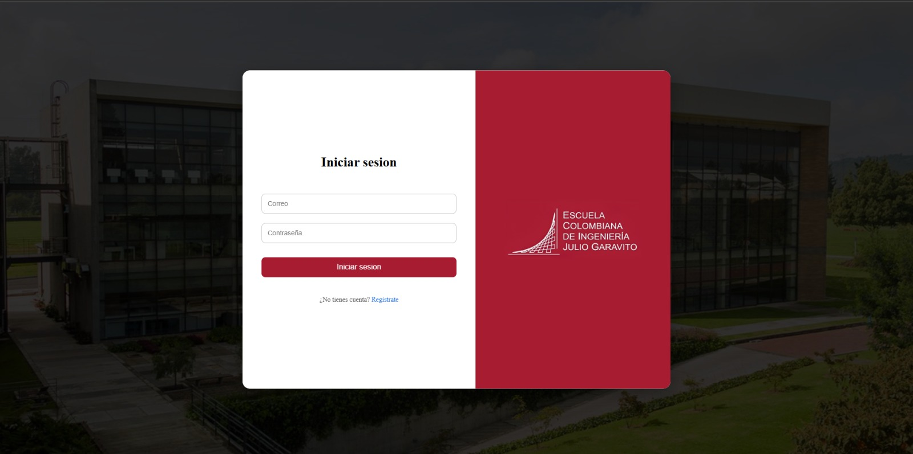
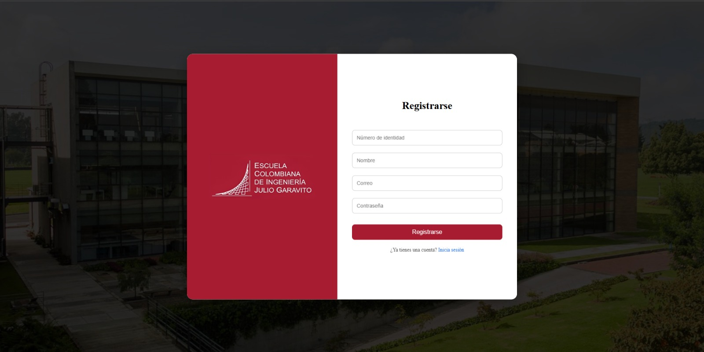
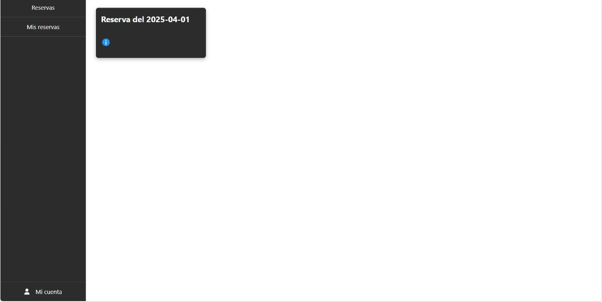
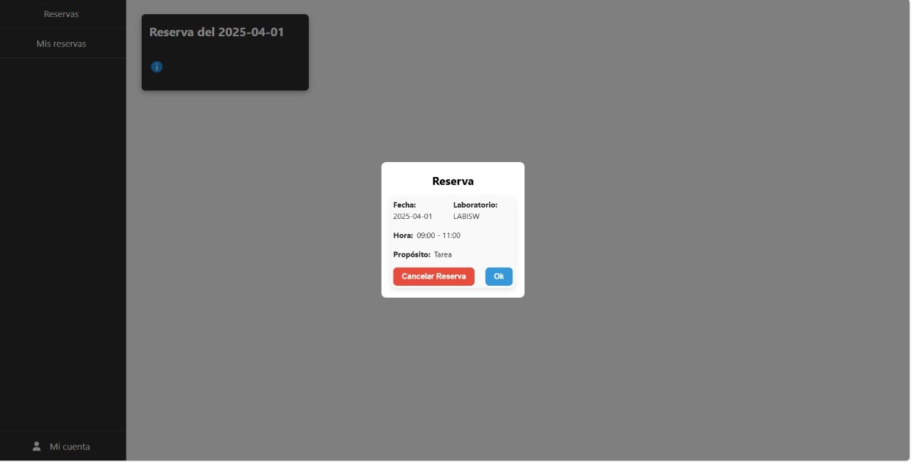
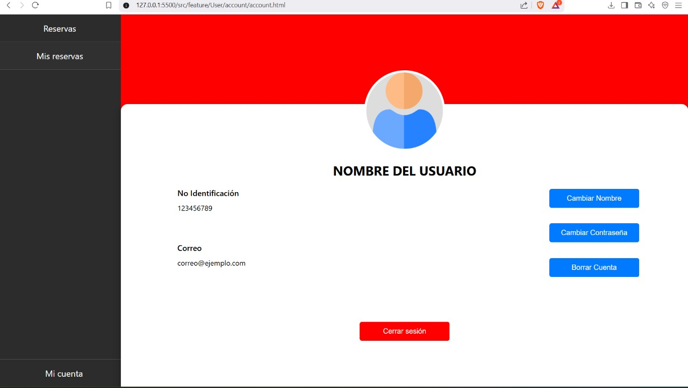

# 🎯 LABORATORIOS

**Escuela Colombiana de Ingeniería**  
📌 _Ciclos de Vida de Desarrollo de Software_

---

## 👥 Integrantes del grupo **FENRIR**

- 🏆 **Vicente Garzón Rios**
- 🏆 **Daniel Alejandro Diaz Camelo**
- 🏆 **Geronimo Martinez Nuñez**
- 🏆 **Carlos David Barrero Velasquez**

---

## 📌 Caso de Negocio: **Sistema de Reservas de Salones**

**Escuela Colombiana de Ingeniería Julio Garavito**

El proyecto consiste en una aplicación para la gestión de reservas de salones dentro de la **Escuela Colombiana de Ingeniería Julio Garavito**.

✔️ Los usuarios podrán **consultar la disponibilidad de salones**, realizar reservas y cancelar sus reservas desde una interfaz web.  
✔️ La aplicación se conectará a un **API REST** desarrollado en **Spring Boot**.  
✔️ Se utilizará **MongoDB Cloud** o **archivo de texto plano** para la persistencia de datos.

---

## ✅ Requerimientos

🔹 El usuario debe poder **consultar la disponibilidad de laboratorios**.  
🔹 El usuario debe poder **reservar un laboratorio** especificando **fecha, hora y propósito**.  
🔹 El usuario debe poder **cancelar sus reservas**.  
🔹 La aplicación debe **validar** que un laboratorio no se pueda reservar si ya está ocupado.

---
# Guía de Uso  

## 1. Inicio de Sesión  
Si ya tienes una cuenta, accede con tu correo electrónico y contraseña.  

## 2. Registro de Cuenta  
Si aún no tienes una cuenta, completa el formulario de registro. La contraseña debe cumplir los siguientes requisitos:  
- Mínimo **8 caracteres**  
- Al menos **una mayúscula**  
- Al menos **un número**  
- Al menos **un carácter especial**  

## 3. Reservaciones  
En este apartado podrás:  
- Seleccionar la **fecha** y la **hora de inicio**  
- Elegir la **duración** de la reserva (en minutos u horas)  
- Asignar un **nivel de prioridad** (del 1 al 5)  
- Elegir el **laboratorio** donde deseas realizar la reserva
- Ver la información **del laboratorio** seleccionado  

## 4. Mis Reservas  
Aquí encontrarás todas las reservas que has realizado.  
- Si no tienes reservas, aparecerá un mensaje notificándolo.  
- Si tienes reservas activas, podrás consultar sus detalles y cancelarlas si es necesario.  

## 5. Mi Cuenta  
En esta sección podrás:  
- Ver y editar tu **información personal**  
- Cerrar sesión de forma segura  

---
## 🌐 Tecnologias utilizadas en Frontend

✔️ HTML5 → Estructura de la página.

✔️ CSS3 → Estilos y diseño (con clases específicas para modales, botones, tarjetas, etc.).

✔️ JavaScript (Vanilla JS) → Funcionalidad del modal, eventos, y manipulación del DOM.